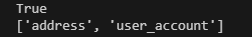
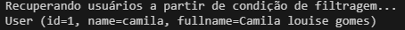
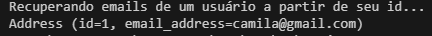
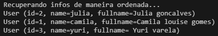
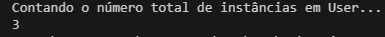
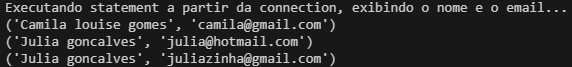

# Gerenciador de Usuários e Endereços com SQLAlchemy

Esse script tem algumas funções:

* Verifica se a tabela "user_account" existe no banco de dados.
* Lista todas as tabelas presentes no banco de dados.

 

* Recupera usuários com base em uma condição de filtragem pelo nome.

 

* Recupera os e-mails de um usuário com base no seu ID.

 

* Recupera informações dos usuários de forma ordenada pelo nome.

 

* Conta o número total de instâncias na tabela "user_account".

 

* Executa uma consulta SQL para exibir o nome e o e-mail dos usuários.

